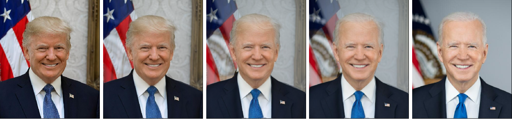
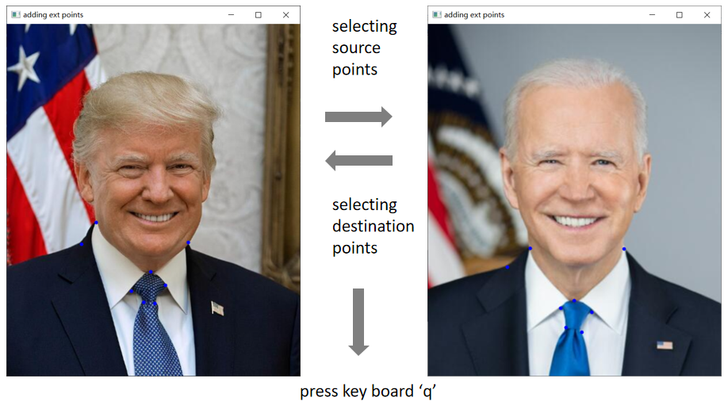

# Face Morphing



# Install

```shell
pip install -r requirements.txt
```

# Usage

## Command Line

running run.py to generate the morphing frames from the source image `./src.jpg` to the destination image `./dst.jpg` and save all results to the folder `./results`.

```shell
python run.py --src=./src.jpg --dst=./dst.jpg --out=./results --ext-points=./ext_points.json --plot --gif
```

more options

```shell

optional arguments:
  -h, --help            show this help message and exit
  --src SRC             source image
  --dst DST             destination image
  --out OUT             output folder
  --bg BG               the type of background
  --ext-points EXT_POINTS
                        use exact points file(json), gui windows for selection if file does not exist
  --plot                whether to show plot
  --num-frames NUM_FRAMES
                        number of output frames
  --gif                 whether to save gif
  --mesh                whether to show mesh
  --fps FPS             fps of gif output
  --size SIZE           output size of a single image
```

`--gif` options


## Explaining about --ext-points

The program can landmark the 68 points on face automatically by `dlib` library. 

To make the morphing process more smooth, trying option `--ext-points` to load extra points which were saved in a json file.

what about json file not exists? Don't worry. 

If you set the `--ext-points` option but the file isn't created, there is a **GUI for selecting the extra points manually**. All extra points you selecting will be saved to `--ext-points`.



# Reference

[Topic 7: Image Morphing](https://www.cs.toronto.edu/~mangas/teaching/320/slides/CSC320T12.pdf)

[Face Morphing using Delaunay Triangulation](https://devendrapratapyadav.github.io/FaceMorphing/) 

[Face Morph Using OpenCV — C++ / Python](https://learnopencv.com/face-morph-using-opencv-cpp-python/)

[Face Morpher](https://github.com/alyssaq/face_morpher) 
